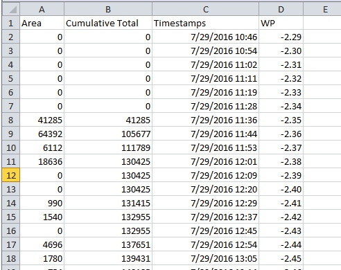

# Analysis Instructions

## What you'll need

* Computer with Microsoft Excel installed - Excel version 2010 and up.
* CSV or Excel file listing embolism areas for a captured sequence - see [OpenSourceOV/image-processing-instructions](https://github.com/OpenSourceOV/image-processing-instructions) for more information and instructions.
* CSV or Excel file of measured water potentials over time
* CSV or Excel file of timestamps for images in the capture sequence - see [Extracting Image Timestamps](#extracting-image-timestamps) for instructions.

## Instructions

A completed [example.xls](./example.xls) can be downloaded for reference.

1. Follow the [Extracting Image Timestamps](#extracting-image-timestamps) instructions to generate a file that contains the timestamps for all the captured images.

2. Open the CSV/Excel file containing the areas. The file only needs to list the areas but the areas must be in the same order as the original image sequence. If using the results file from [OpenSourceOV/image-processing-instructions](https://github.com/OpenSourceOV/image-processing-instructions) then this will be in the correct order but will have a number of other columns that need to be removed.

    The file should look something like this:

        

3. Create an cumulative area total column.

    * Set the formula for cell B2 to '=A2'

         

    * Set the formula for cell B3 to '=A3+B2'

        

    * Copy cell B3 to the remaining rows (copy, drag or double-click the corner).
  
         
    

4. Copy the timestamps from the timestamps.csv file into column C in the analysis spreadsheet.

    * Open the timestamps.csv file and copy the values from the timestamps column

        

    * Paste into column C in the analysis spreadsheet
    
        
    
    * Make sure the cells are in a datetime format

        

5. Create a new worksheet for the water potentials.

    

6. Add the measured water potentials and times into two separate columns. 

    In this example we have continuous measurements from a psychrometer but fewer points measured manually with a pressure bomb would also be fine and processed in the same way.

    

7. Ensure the timestamps are in a datetime format
    
    

8. Plot WP against time using the scatter chart

    

9. Apply an appropriate regression.

    For this data we can apply a linear regression. Depending on your water potential data you may need to apply a non-linear regression, or apply a linear regression in phases.

    

10. Calculate each of the regression parameters in separate cells so we can reference them later.

    This is important because we need the parameters to be accurate to more decimal places than can be seen in the regression equation on the scatter plot. Don't copy the values from the equation.

    * For the slope use the function **slope(x_values, y_values)**
        
        

    * For the intercept use the function **intercept(x_values, y_values)**

        


11. Back on the first sheet in a new column use the regression parameters to calculate the water potential for each timestamp.

    The formula for each row will be:

    ```
    timestamp * regression slope + regression intercept
    ```

    For example, say we want to calculate the WP for the timestamp on column C row 2 and our slope for the linear regression is on a sheet called 'WP' in column D row 3 and the intercept on column E row 3 we would use the formula:

    ```
    C2 * WP!$D$3 + WP!$E$3
    ```
    
    

    Set the format of the cells to a number:

    

    Copy to all rows:

    


12. We can now plot WP against the cumulative area, but it would be easier to understand if we made the cumulative area relative to the total cumulative area. In this way we are representing percentage increase in embolism as a function of water potential.

    * The formula we want to apply is:

    ```
    Cumulative Total / Max(Cumulative Totals) * 100
    ```

    

13. Plot the relative cumulative area against water potential to create the final optical vulnerability curve.

    
    
    * You may at this point want to shift the negative water potentials to positive values (water potential * -1) and format the plot appropriately or export the calculated values to other applications such as SigmaPlot.

    

    * Depending on the frequency of image captures you will be able to read the water potential at a 50% increase in embolism, a useful measure for comparisons between samples/species, in addition to the water potential of incipient embolism.

    

14. Done!

## Extracting Image Timestamps

The easiest way to extract the timestamps is via the Command Prompt on Windows. 

1. On the computer with the captured images open windows explorer and navigate to the folder containing the images.

    

2. Copy the path to the folder from the address bar (or take a note of the path)

    

3. From the start menu select 'Run' and type 'cmd' into the Open: input box. Press OK.

    

    

4. At the command prompt change to the images directory noted earlier. Type 'cd ' then right-click the command prompt and click 'Paste'. Alternatively type in the path to the folder. Press return.

    

    If the images folder is on a different drive to C:\ then you will need to change to the drive name first by typing the drive name followed by a colon, pressing return then issuing the cd command. For example if the image files are on U:\Data\Obliqua\images

    ```
    U:
    cd U:\Data\Obliqua\images
    ```

    

    If the images folder has a space in the path then wrap the path in quotes when issuing the cd command e.g. if the path is C:\Data\Eucalpytus Obliqua\images

    ```
    cd "C:\Data\Eucalpytus Obliqua\images"
    ```
    
5. Extract the timestamps and write them to a file using the 'dir' command:

    In the command prompt type:

    ```
    dir > timestamps.csv
    ```
    
    


6. The timestamps should now be saved to a file in the images folder called timestamps.csv. Double-click the file to open and review in excel - no need to do a CSV import from a new excel document.

    


